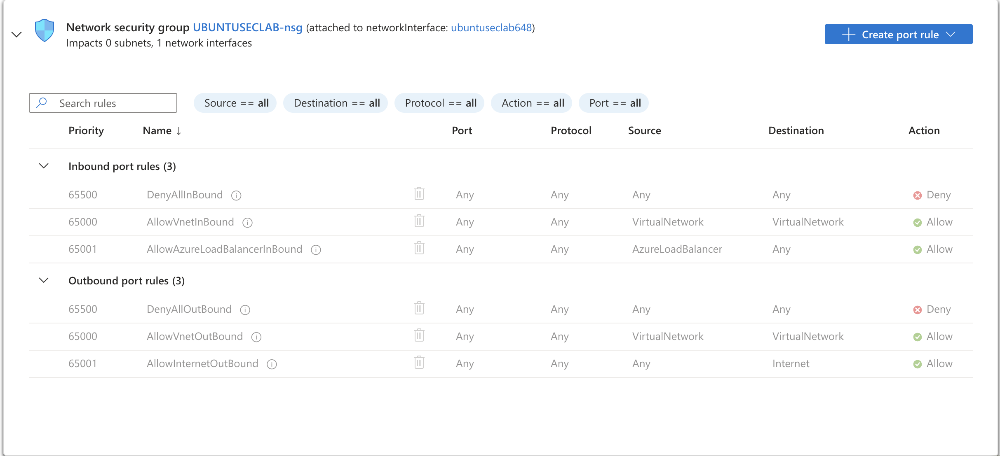

# Lab 02 — Hardening de VM en Azure + Detección de Ataque de Fuerza Bruta

**Categoría:** Cloud Security · Hardening · Brute Force Detection · Log Analysis  
**Entorno:** Microsoft Azure · Ubuntu Linux  
**Fecha:** 2025  
**Dificultad:** Básico-Intermedio

---

## 1. Objetivo

- Desplegar una máquina virtual Ubuntu en Microsoft Azure y asegurarla aplicando reglas de firewall sobre el puerto SSH desde la terminal.
- Simular un ataque de fuerza bruta controlado contra la propia VM.
- Revisar y analizar los logs generados en Azure para validar la detección del ataque.

---

## 2. Arquitectura del Entorno

| Componente | Detalle |
|---|---|
| Proveedor Cloud | Microsoft Azure |
| Sistema Operativo | Ubuntu Linux |
| Terminal Usada | Warp |
| Servicio Objetivo | SSH (puerto 22) |

---

## 3. Fases de Ejecución

### Fase A — Despliegue de la VM en Azure

Se aprovisionó una máquina virtual con Ubuntu Linux en Microsoft Azure como entorno de laboratorio, habilitando el acceso remoto por SSH para su administración.

### Fase B — Configuración del Firewall sobre SSH

Desde la terminal Warp se gestionó la configuración del firewall aplicando reglas sobre el puerto SSH (22), controlando qué tráfico podía alcanzar el servicio de acceso remoto y reduciendo la superficie de ataque expuesta de la VM.

### Fase C — Simulación del Ataque de Fuerza Bruta

Se ejecutó una simulación controlada de un ataque de fuerza bruta contra el servicio SSH de la propia VM, con el fin de generar intentos de autenticación fallidos y observar el comportamiento del sistema ante el ataque.

### Fase D — Análisis de Logs en Azure

Se revisaron los logs disponibles en Azure para identificar la evidencia del ataque de fuerza bruta: los intentos de autenticación fallidos y el patrón de conexión repetida contra el puerto SSH, validando que la actividad maliciosa quedara registrada y fuera detectable.

---

## 4. Evidencia — Estado posterior al hardening (NSG)

Estado del Network Security Group `UBUNTUSECLAB-nsg` asociado a la interfaz de red de la VM tras aplicar el endurecimiento. La regla **DenyAllInBound** (prioridad 65500) bloquea todo el tráfico entrante no permitido explícitamente, dejando únicamente las reglas base de la red virtual y del balanceador de carga.

---

## 5. Aprendizajes

- Configuración práctica de reglas de firewall sobre el puerto SSH desde la terminal (Warp) para reducir la superficie de ataque de una VM en la nube.
- Comprensión del rastro que deja un ataque de fuerza bruta en los registros y de cómo revisarlo desde la plataforma de Azure.
- Refuerzo del enfoque defensivo: prevención (firewall/hardening) combinada con detección (análisis de logs).
